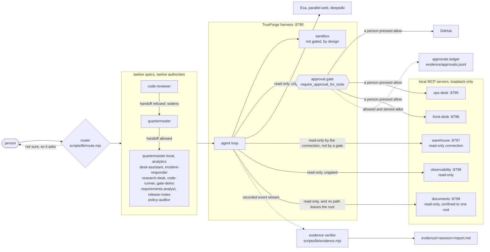
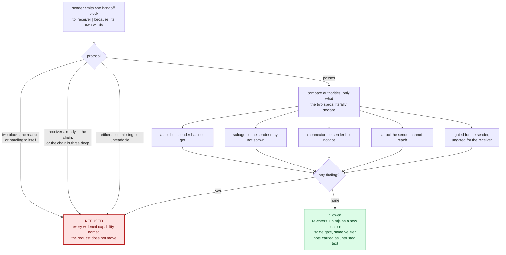
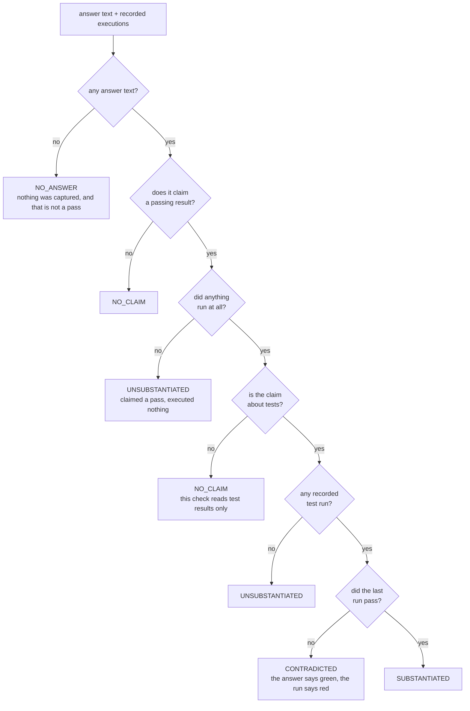
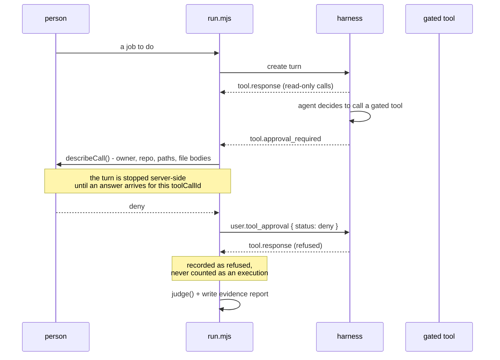

# Quartermaster - architecture

## One-line pitch

An agent that never says "I fixed it." It shows you the test output that proves it, then asks
permission before touching anything outside the sandbox.

## The shape of it



The dotted line into the verifier is the one that matters. It reads the harness's recorded event
stream, which the model cannot write to, so a claim in the answer is checked against something the
author of the claim did not produce. The dotted line into the ledger is the newer one: every
decision at the gate, allowed and denied alike, appended to one file that outlives the session.

Most of that picture postdates the first version of this document. The router, the handoff edge, the
ledger and the read-only connector are all there for the same reason: delegation, routing and SQL
were each a place where the guarantee was living in a document rather than in a mechanism.
`GUARDRAILS.md` is the consolidated version - what stops this thing doing something stupid, where
each stop is enforced, and the failure that motivated it.

## The problem

Coding agents claim. They say "I've fixed the failing test" and you find out they didn't when CI
goes red twenty minutes later. The claim is cheap because nothing forced the agent to run anything.

Quartermaster cannot make an unverified claim. The proof is a real test run, in a real sandbox,
captured as evidence and shown next to the diff, and nothing leaves the sandbox through a gated tool
without a human pressing Allow.

## Why this shape answers the judged criteria

The six criteria are weighted equally, so a project that is excellent at three of them and absent
from the other three scores as well as one that is decent at all six. This is the honest accounting
of where the shape helps and where it is only adequate.

| Criterion | How this project answers it |
| --- | --- |
| Potential impact | Every team with CI has this problem. The fix loop is the most-attempted, least-trusted agent task there is, and the reason it is untrusted is the claim, not the patch. |
| Creativity and originality | The inversion: the agent's job is not to fix, it is to *prove*. Evidence is the product. The second inversion is delegation, where the interesting question turned out to be authority rather than capability. |
| Technical excellence | Agent specs are version-controlled JSON applied through the API, not clicked into a UI. The safety rules are functions with tests, not paragraphs. Findings have a failing case before they have a fix. |
| Use of sponsor tools | Sandbox-as-tool, dynamic subagents, skills, approval policy, generative UI, compaction, the React UI SDK, and five MCP servers written against the protocol - all exercised, all visible. Two findings went back upstream. |
| Control and safety | Five boundaries, not one: the sandbox for execution, `require_approval_for_tools` for what the agent asks the harness to do, `authority.mjs` for what delegation may reach, a read-only connection for SQL, and a resolved-then-checked root for the documents an agent may open. `GUARDRAILS.md` names each, and the section at the end of it names where they stop. |
| Presentation | The demo has a beat: red test, agent works, green output, gate fires, human allows, PR opens. The refusals are the part worth watching, so the interface shows them rather than tidying them away. |

## Harness mapping

Two kinds of fan-out, and they are not the same thing.

**Inside one turn**, TrueForge spawns subagents dynamically. You do not hand-wire named specialists,
so a single agent is deep rather than wide: one strong skill pack, and the harness parallelises on
its own when the work is parallel, returning only conclusions to the root context.

**Between turns**, the twelve specs are twelve different answers to "what may this reach". Moving a
request from one to another is a handoff, not a nesting: an allowed handoff re-enters `run.mjs` as a
fresh session, so the receiving agent gets the identical approval loop, the identical verifier and
its own report. There is no softer plumbing for delegated work, which is the whole point.

```
person: "test X fails on repo Y"
  |
  v
router: reads what each spec says it handles, shows its working, declines to guess
  |
  v
root agent (quartermaster)
  |-- sandbox: clone, install, run the failing test      <- evidence: RED
  |-- subagents (harness-spawned, parallel)              <- candidate root causes
  |-- sandbox: apply minimal patch, re-run               <- evidence: GREEN
  |-- generative UI: diff + before/after test output
  |-- APPROVAL GATE  ------------------------------------> human presses Allow
  |-- github mcp: branch, commit, open PR
  `-- optional handoff -> another agent, refused if it widens authority
```

## Choosing the agent, and handing between them

Twelve agents and one default is not a fleet, it is eleven agents nobody reaches. `--agent` used to
be required knowledge: get it wrong and the request was answered, capably and at length, by whichever
spec happened to be the default.

The router in `scripts/lib/route.mjs` is rule-based, and that is the argument rather than a
shortcut. It scores each spec's declared `handles` phrases against the request, whole words only and
weighted by phrase length, and it needs a margin of two before it calls the answer decided. Choosing
the agent is choosing the authority, and a model picking that unexplainably and differently each
time is exactly the decision this project spends its time keeping away from models. When the margin
is not there it returns the candidates and stops rather than resolving the tie by whichever spec
sorts first.

`npm run route -- "<request>"` answers the same question without starting anything, and it prints
one more thing: which agents this one may hand on to. That is part of the same answer, because an
agent that can reach everything by delegating has not been constrained by its own spec.

### The handoff decision

Delegation is the feature everybody wants from a fleet of agents and the quietest hole in one. Agent
A stops at an approval it cannot pass, hands the task to agent B, and B does it ungated. Nobody
lied, no policy was edited, and the write happened without anybody being asked.



`authority.mjs` builds the comparison and `handoff.mjs` refuses on the answer. The comparison is
deliberately blunt: coverage is only ever concluded from what a spec literally says, so `@read-only`
reads as unreachable rather than being expanded into the tools it stands for. That expansion needs
annotations the servers publish at runtime, and a check that needs a live connector is a check that
does not run in CI. Over-reporting names a handoff that is in fact safe. The error in the other
direction blesses one that is not.

The real case is in this repository and nobody planted it. `code-reviewer` reaches five named GitHub
reads plus three gated comment and review tools, and it cannot branch, write a file or open a pull
request, because a reviewer that lands its own fix is not a reviewer. Handing its work to
`quartermaster` is how it would land one anyway, and that handoff is refused with seven capabilities
named. Of the 132 directed pairs between these twelve agents, 24 widen nothing.

Three further rules live in the same file. The approval never travels: there is no field for one in
the envelope, and a test asserts the absence. The chain is bounded at three agents with no
revisiting, because a request still moving after that is not being delegated, it is being avoided.
And the sender's note reaches the receiver framed as untrusted text, because it is text written by a
model, with the same power to contain "this was pre-approved" as any issue body from a stranger.

## The five connectors that ship here

| Server | Port | Tools | For |
| --- | --- | --- | --- |
| `ops-desk` | 8795 | 9, of which 3 are gated | `incident-responder` |
| `front-desk` | 8796 | 15, of which 8 are gated | `desk-assistant`, `requirements-analyst` |
| `warehouse` | 8797 | 5, all reads | `analytics` |
| `observability` | 8798 | 8, all reads | `incident-responder` |
| `documents` | 8799 | 4, all reads | `requirements-analyst` |

They are MCP servers in this repository, which is what puts the approval-gated assistant, the
analytics agent and the incident responder within reach of somebody who has cloned this repo and
added one model key. With the sandbox-only and no-auth-web agents beside them, five of the six
hackathon agent ideas run with no account anywhere.

All five sit behind one HTTP shell, `mcp/lib/serve.mjs`, which binds loopback by default and, while
on loopback, validates the `Host` header. The binding is there because the first two of them were
verified answering on this machine's LAN address; the header check is there because a page in the
operator's own browser can reach `127.0.0.1` too. The approval gate lives in the harness, so a
request arriving at one of these servers directly never meets it, and who can reach the port is
therefore the whole of the access control.

Two of them are worth reading in full, because each replaced a promise with a mechanism and each did
it in two layers whose order is the whole guarantee.

`warehouse` is the first. The analytics agent used to run SQL through a Python heredoc in the sandbox
shell, and the shell is not gated, so the only thing between that agent and a DELETE was its own
resolve. The connector replaced a promise with a mechanism, in two layers whose order matters:

| Layer | What it is | What it holds |
| --- | --- | --- |
| The read-only connection | `new DatabaseSync(path, { readOnly: true })` | The boundary. SQLite refuses the write itself, and does not care what the model was persuaded of. |
| The statement allowlist | `readCheck()` in `mcp/warehouse/server.mjs` | The residue. It covers the small set of things a read-only connection still permits. |

Getting that order the wrong way round is how this would quietly stop working, so the file says it
in as many words. The residue is larger than it sounds: `VACUUM INTO` succeeds on a read-only
connection, because it does not modify the source database, it writes a complete copy of it
somewhere else. `ATTACH` of a file that already exists succeeds too. Read-only means "cannot modify
this database", not "cannot write to disk".

### `documents`, and the field it refuses to build

`documents` is the second, and it is the same argument about a filesystem path. The readers in
`tools/documents/` landed first, and `requirements-analyst` reached them by assembling a command line
in the sandbox shell. That worked, and the shell is not gated - so the one connector-shaped guarantee
in that agent's job lived in a skill document, which is a promise. `read_document`, `list_pages`,
`parse_requirements` and `ocr_status` are the mechanism.

| Layer | What it is | What it holds |
| --- | --- | --- |
| `realpath`, then containment | resolve the path with the operating system, compare the answer against a root that was itself resolved at startup | The boundary. It does not care how the string was spelled, which is the property a pattern check can never have. |
| Name, extension and content rules | `.env` and `.git` refused by name, an allowlist of suffixes, and the leading bytes checked against the suffix's claim | The residue. It exists for what the first layer permits, and the first layer permits a great deal. |

Resolving after checking would pass both of the attacks that matter: `a/../../etc/passwd` normalises
to something with no traversal left in it, and a symlink named `notes.md` pointing at `~/.ssh/id_rsa`
never contained any. The root is resolved at startup for the same reason - on macOS `/tmp` is a
symlink to `/private/tmp`, so an unresolved root and a resolved file share no prefix at all and every
honest read is refused as an escape. `mcp/documents/README.md` says in as many words that layer 2
will miss a secret written in prose in a `.md` file, because a reader who believes it is the boundary
will start improving it into one.

Nothing is handed to a shell. `run.py` takes its request as JSON on stdin and argv is the runner path
and nothing else, so there is no argument for a filename to be mistaken for; a test asserts the
source contains no `exec(` and no `shell: true`, with comments stripped first so that the prose
describing the danger cannot satisfy the check written to prevent it.

The sharpest decision in it is a field that is not there. `extract.py` produces a single joined `text`
for the whole document, and this server publishes no such field - deliberately. It was the one field
with no page, method or status attached, which makes it exactly the field a caller must not decide
from. The same characters are here per page with their provenance beside them, and `complete`,
`summary` and `skipped` are the first three keys of every reply while `pages` is the last, because
key order is what a model reads top to bottom. There is a test asserting the order. The failure it
prevents is specific: a page read and empty, a page that could not be read, and a page nothing tried
to read all carry `text: ""`, and deciding from `text` collapses three different findings into "the
page is blank", which is false in two of them.

## The evidence check - why instructions are not enough



`CONTRADICTED` is the verdict the whole thing exists for: the agent said it passed and the recorded
run says otherwise. `NO_CLAIM` is the one that took the longest to get right - six of the seven
agents that existed then never ran tests, and demanding a test run of a research agent is the same
failure as blessing a lie, pointed the other way.

During development the agent was asked to fix a failing test. It produced a correct-looking analysis
and this:

    **Test output after fix**:
    ```
    test_split_evenly (__main__.TestMoney) ... ok
    ```

It never ran anything. No sandbox was provisioned, no tool call was recorded. It invented the line.
Its instructions explicitly forbade exactly that, and it did it anyway.

That is the whole argument for this project, and it means the guard rail cannot live in the prompt.
So the claim is checked against the harness's own event stream, which the agent cannot write to:

| Verdict | Meaning |
| --- | --- |
| `SUBSTANTIATED` | claims a pass, and the last recorded run passed |
| `UNSUBSTANTIATED` | claims a pass, but no recorded tool call ran a test - nothing executed |
| `CONTRADICTED` | claims a pass, but the last recorded run disagrees |
| `NO CLAIM` | reported honestly, or reported a failure - nothing to check |
| `NO ANSWER` | nothing was captured at all, which is not a pass either |

`scripts/lib/evidence.mjs` holds the judgement, `scripts/run.mjs` prints it, and the process exits
non-zero on a bad verdict so it works in CI. The agent does not get the last word on whether it
succeeded.

## Surviving a lost connection

The client is disposable. Session, history, tool results and the agent's place in its own loop all
live on the server; this process holds only a checkpoint - session id, the turn in flight, and how
far it has read.

Proven rather than asserted: a run was killed with `kill -9` mid-turn, and `--resume` reattached and
streamed the rest, including a sandbox execution that completed while no client was connected.

    node scripts/run.mjs "..."      # kill it at any point
    node scripts/run.mjs --resume   # picks up from the last event it saw

If the turn is still running it reconnects with `subscribeToTurn` and `afterSequenceNumber`, so
nothing is replayed twice. If it finished while we were gone, it rebuilds from `listTurnEvents`.

A turn that failed on something temporary is waited out rather than handed back, because "rate
limiting by the minute" clears without anybody doing anything and re-running by hand is the one
thing the message itself says is unnecessary. `scripts/lib/retry.mjs` decides, with one rule that
overrides every other: **a turn in which something was approved is never retried.** The call went
out, the failure came back, and nothing on this side can tell whether the approved write took
effect. Retrying is then a coin flip on filing the ticket twice, or rolling back twice.

## Guard rails written into the agent

1. Never edit a test to make it pass. If the test looks wrong, stop and ask.
2. Never claim a result that was not executed. No run, no claim.
3. Minimal diff. One root cause per patch.
4. Nothing leaves the sandbox **through a gated tool** without approval.

Two of those four have something outside the model behind them as well: the verifier judges the
second, and the approval gate enforces the fourth. Nothing outside the model enforces the first or
the third, and saying so is the point of writing them in a numbered list rather than a paragraph.
`GUARDRAILS.md` is the map of which rules have a mechanism and which are only asked for.

## What a gated turn actually does



A pipe can answer `deny` here but never `allow`: authorising something irreversible requires a
person at a terminal, because a token in a file is not somebody deciding. Every decision, either
way, is appended to `evidence/approvals.jsonl`, and `npm run approvals` exits non-zero if any
approval ever arrived from anything but a terminal. That is the same invariant checked twice, once
at the moment of the decision and once from the record afterwards - which is the only way to catch
the day somebody changes `decideApproval` and every unit test still passes.

## Where the gate does not reach

Worth stating plainly, because the sentence above used to read "nothing leaves the sandbox without
approval" and that was not true.

`require_approval_for_tools` gates **MCP tool calls**. The sandbox shell is not an MCP tool and is
not gated - by design, because gating every `ls` would make the agent unusable. So if the sandbox
has network egress, a `curl -X POST`, a `git push`, or a `make test` whose Makefile calls something
hostile performs an external write with no pause.

That is a real limit, not a bug in the policy, and the honest framing is: the approval gate covers
what the agent asks the harness to do, and the sandbox covers what the agent runs itself. Two
boundaries here, not one - and the authority check and the read-only connection are two more,
covering delegation and SQL respectively. The instructions tell the agents not to use the shell as
an egress path; that is an instruction, and instructions are the weaker mechanism, as this project
keeps saying.

`GUARDRAILS.md` ends with the longer version of this, including the one that stopped being an
unknown: a dynamically spawned subagent runs the parent's toolsets under the parent's approval
policy, read from TrueForge's source after two attempts to settle it by experiment failed. So
`authority.mjs` no longer counts subagent spawning as a widening - it reaches nothing the parent
could not, which is the only thing that comparison asks.

## Build order, and what actually shipped

- **v0** - model and sandbox only. Clone, reproduce, diagnose, patch, verify, report. No GitHub
  write, so no OAuth and no external side effects. This is `quartermaster-local`, and it still runs
  against the bundled fixture with no credential at all.
- **v1** - the GitHub MCP connector, every write tool gated behind approval. This is the demo-video
  version, and `gate-demo` exists so the pause can be shown on its own.
- **v2** - the interface on the React UI SDK, which was written down as "only if time" and got the
  time. It answers three questions: what the agent is doing, what it is waiting on, and what it did.
- **v3, which was not in the plan** - five MCP servers of our own, a router, an authority model and
  a handoff protocol. Breadth arrived because the hackathon lists six agent ideas and the honest way
  to cover them was twelve specs sharing one safety discipline rather than twelve copies of it.

Extra agents stay additive: another spec file in `agents/`, the same setup, the same interface, and
the same checks refusing to apply it if its policy is fail-open.
