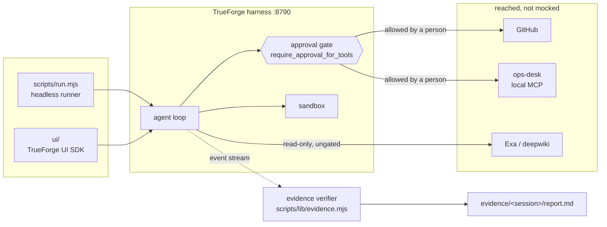
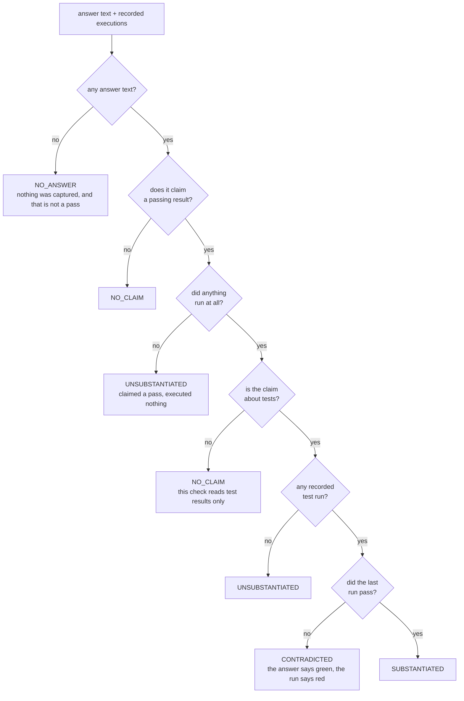
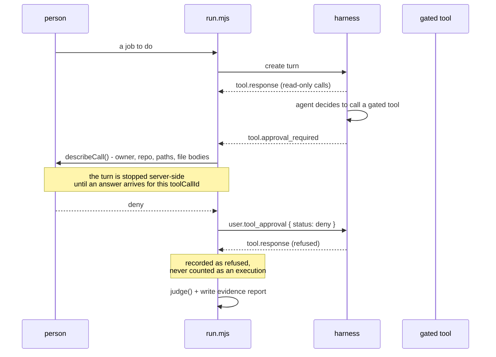

# Quartermaster — architecture

## One-line pitch

An agent that never says "I fixed it." It shows you the test output that proves it, then asks
permission before touching anything outside the sandbox.

## The shape of it



The dotted line is the one that matters. The verifier reads the harness's recorded event stream,
which the model cannot write to - so a claim in the answer is checked against something the author
of the claim did not produce.

## The problem

Coding agents claim. They say "I've fixed the failing test" and you find out they didn't when CI
goes red twenty minutes later. The claim is cheap because nothing forced the agent to run anything.

Quartermaster cannot make an unverified claim. The proof is a real test run, in a real sandbox,
captured as evidence and shown next to the diff — and nothing leaves the sandbox without a human
pressing Allow.

## Why this shape wins the judged criteria

| Criterion | How this project answers it |
| --- | --- |
| Potential impact | Every team with CI has this problem. The fix loop is the most-attempted, least-trusted agent task there is. |
| Creativity | The inversion: the agent's job is not to fix, it is to *prove*. Evidence is the product. |
| Technical excellence | Agent specs are version-controlled JSON applied through the API, not clicked into a UI. |
| Use of TrueForge | Sandbox-as-tool, dynamic subagents, skills, approval policy, generative UI, compaction — all exercised, all visible. |
| Control and safety | Two gates: sandbox isolation for execution, `require_approval_for_tools` for anything that writes to GitHub. |
| Presentation | The demo has a beat: red test, agent works, green output, gate fires, human allows, PR opens. |

## Harness mapping

TrueForge subagents are spawned dynamically by the harness — you do not hand-wire named
specialists. So the design is **one deep root agent** with a strong skill pack, not a hierarchy of
four agents. The harness fans out to parallel subagents on its own when the work is parallel
(e.g. several candidate root causes investigated at once), and only their conclusions return to the
root context.

```
user: "test X fails on repo Y"
  |
  v
root agent (quartermaster)
  |-- sandbox: clone, install, run the failing test      <- evidence: RED
  |-- subagents (harness-spawned, parallel)              <- candidate root causes
  |-- sandbox: apply minimal patch, re-run               <- evidence: GREEN
  |-- generative UI: diff + before/after test output
  |-- APPROVAL GATE  ------------------------------------> human presses Allow
  `-- github mcp: branch, commit, open PR
```

## Build order

- **v0 (today)** — model + sandbox only. Clone, reproduce, diagnose, patch, verify, report.
  No GitHub write, so no OAuth and no external side effects. Runs against a public repo or the
  bundled fixture.
- **v1** — attach the GitHub MCP connector. Every write tool gated behind approval. This is the
  demo-video version.
- **v2 (only if time)** — custom front-end on the React UI SDK for the Best UI track.

Extra agents are additive: another spec file in `agents/`, same setup, same UI. Flagship goes deep
first; breadth is bonus, never at the cost of depth.

## The evidence check — why instructions are not enough



`CONTRADICTED` is the verdict the whole thing exists for: the agent said it passed and the recorded
run says otherwise. `NO_CLAIM` is the one that took the longest to get right - six of the seven
agents never run tests, and demanding a test run of a research agent is the same failure as
blessing a lie, pointed the other way.


During development the agent was asked to fix a failing test. It produced a correct-looking analysis
and this:

    **Test output after fix**:
    ```
    test_split_evenly (__main__.TestMoney) ... ok
    ```

It never ran anything. No sandbox was provisioned, no tool call was recorded. It invented the line.
Its instructions explicitly forbade exactly that, and it did it anyway.

That is the whole argument for this project, and it means the guard rail cannot live in the prompt.
So the claim is checked against the harness's own event stream, which the agent cannot write to:

| Verdict | Meaning |
| --- | --- |
| `SUBSTANTIATED` | claims a pass, and the last recorded run passed |
| `UNSUBSTANTIATED` | claims a pass, but no recorded tool call ran a test - nothing executed |
| `CONTRADICTED` | claims a pass, but the last recorded run disagrees |
| `NO CLAIM` | reported honestly, or reported a failure - nothing to check |

`scripts/lib/evidence.mjs` holds the judgement, `scripts/run.mjs` prints it, and the process exits
non-zero on a bad verdict so it works in CI. The agent does not get the last word on whether it
succeeded.

## Surviving a lost connection

The client is disposable. Session, history, tool results and the agent's place in its own loop all
live on the server; this process holds only a checkpoint - session id, the turn in flight, and how
far it has read.

Proven rather than asserted: a run was killed with `kill -9` mid-turn, and `--resume` reattached and
streamed the rest, including a sandbox execution that completed while no client was connected.

    node scripts/run.mjs "..."      # kill it at any point
    node scripts/run.mjs --resume   # picks up from the last event it saw

If the turn is still running it reconnects with `subscribeToTurn` and `afterSequenceNumber`, so
nothing is replayed twice. If it finished while we were gone, it rebuilds from `listTurnEvents`.

## Guard rails written into the agent

1. Never edit a test to make it pass. If the test looks wrong, stop and ask.
2. Never claim a result that was not executed. No run, no claim.
3. Minimal diff. One root cause per patch.
4. Nothing leaves the sandbox **through a gated tool** without approval.

## What a gated turn actually does



A pipe can answer `deny` here but never `allow`: authorising something irreversible requires a
person at a terminal, because a token in a file is not somebody deciding.

## Where the gate does not reach

Worth stating plainly, because the sentence above used to read "nothing leaves the sandbox without
approval" and that was not true.

`require_approval_for_tools` gates **MCP tool calls**. The sandbox shell is not an MCP tool and is
not gated - by design, because gating every `ls` would make the agent unusable. So if the sandbox
has network egress, a `curl -X POST`, a `git push`, or a `make test` whose Makefile calls something
hostile performs an external write with no pause.

That is a real limit, not a bug in the policy, and the honest framing is: the approval gate covers
what the agent asks the harness to do, and the sandbox covers what the agent runs itself. Two
boundaries, not one. The instructions tell the agents not to use the shell as an egress path; that
is an instruction, and instructions are the weaker of the two mechanisms this project keeps saying
so.
