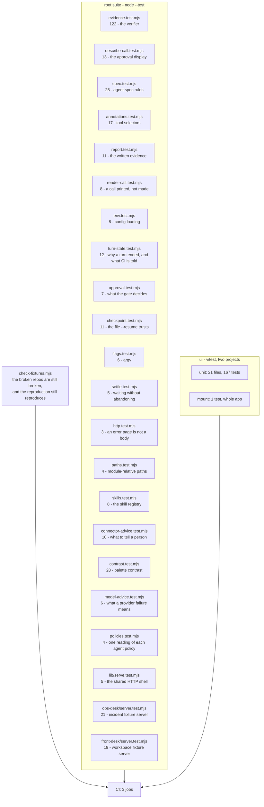

# Testing

353 tests in the root suite, 167 in the UI across 21 files, one mount test, and a fixture check. What follows is
how they are organised and — more usefully — the rules they are written under, because several of
them exist because a test once agreed with a bug and let it ship.

## Running them

```bash
npm run check        # lint + typecheck + tests + fixture check. The same gates CI runs.
npm test             # root suite only (node --test)
npm run lint         # eslint
npm run typecheck    # tsc --noEmit

cd ui
npm run test:unit    # 167 tests, jsdom
npm run test:mount   # the one test that mounts the whole app
npm run build        # production build
```

`npm run check` is the one to run before pushing. Running `npm test` alone will not catch a lint
error or a type error, and both have reached a pull request from here before.

> A note that cost real time: never pipe a test command into `grep`. `npm test | grep FAIL` reports
> **grep's** exit code, not the suite's, so a red suite reads as green. Capture to a file and check
> `$?`, or read the summary line.

## The layout



### Root suite — `scripts/lib/*.test.mjs`

| File | What it holds the line on |
| --- | --- |
| `evidence.test.mjs` | The verifier. Most of the file is negative cases: ways an agent could make a command look like a test run without running one, and ways an honest run could be mistaken for a fake. |
| `describe-call.test.mjs` | What the operator sees before approving. Every case is "the display must not hide or misrepresent what will be sent." |
| `spec.test.mjs` | Rules agent specs must satisfy — no fail-open approval policy, no promise of a gate that nothing enforces, no sandbox setting by omission. |
| `annotations.test.mjs` | How `@read-only`, `@write` and `@destructive` resolve from tool annotations, including that an unannotated tool matches none of them. |
| `report.test.mjs` | The written report: counts, refusals, fenced output, why a turn failed, and that a model-controlled command cannot forge a section of it. |
| `approval.test.mjs` | The gate's two invariants, in the one place both can be checked: a pipe may deny but never approve, and every outcome that is not an exact allowing word is recorded as a refusal. |
| `checkpoint.test.mjs` | The file `--resume` trusts. Read as if somebody else wrote it, written whole or not at all, and never allowed to choose where the report is filed. |
| `turn-state.test.mjs` | Why a turn ended, and what the process then tells CI - a run that crashed, stalled or died on the plumbing must not exit 0. |
| `flags.test.mjs`, `paths.test.mjs`, `settle.test.mjs`, `http.test.mjs` | Four one-line mistakes that each cost a real behaviour: a flag consumed as another flag's value, a percent-encoded path, a promise raced and abandoned, and an error page parsed as data. |
| `mcp/front-desk/server.test.mjs` | The workspace server: every write tool refuses what it cannot honestly do and records nothing when it refuses, and the planted prompt injection is still in the fixture - if it is ever removed, the demonstration that the gate holds against a persuaded model silently stops demonstrating anything. |
| `mcp/ops-desk/server.test.mjs` | The fixture MCP server, tested over the wire: every tool publishes the annotations the selectors resolve from, the destructive ones genuinely mutate, and the fixture still tells a story an investigation can get right. The log tests pin the correlation - alert, deploy and log lines all naming the same 2000ms - and the two ways a search can lie about an empty result. |
| `env.test.mjs` (8), `contrast.test.mjs` (28) | Config loading, and that every colour pair in both themes clears 4.5:1 — the reference design's own muted grey was 3.37:1 and had to be darkened. |

### UI — `ui/src/**/*.test.tsx`

Two vitest projects, because they need different things:

- **`unit`** — 21 files, 167 tests, jsdom, components in isolation.
- **`mount`** — one test that mounts the entire app. It exists because the app once rendered a
  blank page while every unit test passed: the crash was an infinite render loop that only appears
  when the real provider stack is assembled. `--dangerouslyIgnoreUnhandledErrors` is scoped to this
  project alone, and nowhere else.

## The rules these are written under

**A test that agrees with the bug is worse than no test.** This has happened here six times, so it
is worth stating precisely. Each of these shipped, and each was caught later by review:

- a test that mocked the hook that was broken, so the breakage was unobservable;
- a fixture named `result.txt` when the defect required it to be named `pytest.log`;
- an assertion that the allowlist behaved the wrong way, written to match the code;
- a `rerender()` with an identical tree, which React skips, so nothing was re-tested;
- an assertion that a rename lost by a failed write should stay lost, beside a comment saying the
  opposite;
- a test that set `localStorage` without announcing it, so the code never read the value under test
  and the assertion passed against a deliberately broken build.

**So: mutation-check anything that matters.** Break the fix, confirm the test fails, restore it.
Not ceremony — the last two in that list were only found this way, and both looked fine.

```bash
cp scripts/lib/evidence.mjs /tmp/e.bak
# revert the fix by hand
node --test scripts/lib/evidence.test.mjs   # must fail, and name the right test
cp /tmp/e.bak scripts/lib/evidence.mjs
```

**Every loosening needs its negative cases written at the same time, not after.** The rule came out
of one function: widening it to recognise `poetry run pytest` opened seven distinct ways to fake a
test run. Whenever a check is relaxed to admit something honest, the cases it must still refuse go
in the same commit.

**Both directions, always.** A guard against fabricated evidence that starts rejecting real work is
not a fix, it is the same failure pointed the other way. Tables in `evidence.test.mjs` are written
in pairs for this reason: what must be refused, and what must still be accepted.

**Test what a person can observe.** UI tests assert on roles and accessible names rather than class
names, so a test fails when the control becomes unusable rather than when the markup moves.

## Fixtures

`fixtures/` holds two deliberately broken repositories the agents are pointed at, and one
reproduction. `npm run fixtures:check` asserts the two are **still broken** — a fixture that quietly
starts passing turns the whole demonstration into a tautology — and that the third still fails on
`4c21` and passes on `9ab7`, because a reproduction that fails in both configurations demonstrates
a broken script rather than a cause. CI runs this as its own job so it cannot be missed.

Stated plainly, rather than left for someone to discover:

### Smoke testing the agents

`npm run smoke` runs each credential-free agent against the real harness and checks that the
harness **recorded** an execution matching what was asked - the same rule as the evidence check:
the transcript is the agent's account, the event stream is what happened.

```bash
npm run smoke                          # every case
npm run smoke -- --agent analytics     # one
SMOKE_BUDGET_SECONDS=420 npm run smoke # a loaded machine, or a slow local model
```

It distinguishes the ways a case can fail, because they send you to different places:

| what it says | what it means |
| --- | --- |
| `no tool response within Ns` | nothing came back. The call may never have been made, or may have been waiting - the runner reads responses, so it cannot tell those apart and does not pretend to |
| `all empty` | the turn was cut short; the machine is loaded, raise the budget |
| `in a shape this runner could not read` | a connector envelope `resultOf` does not handle. No amount of budget fixes it |
| `the sandbox was not ready` | the harness, not the agent. Retried once, and the retry is announced |
| `none matched /regex/` | it ran something and the answer was wrong. This is the interesting one |

That table exists because the suite used to report all four as the last one, which points at the
assertion - the only part that is definitely not wrong.

### What is not covered

- **No end-to-end test drives a real model.** Runs cost money and quota, and a flaky suite that
  depends on a provider is worse than an honest gap. The recorded sessions under `evidence/` are
  the evidence that the real path works; `smoke-agents.mjs` exercises it on demand.
- **The mount test asserts that the app renders, not that it looks right.** Nothing here catches a
  visual regression.
