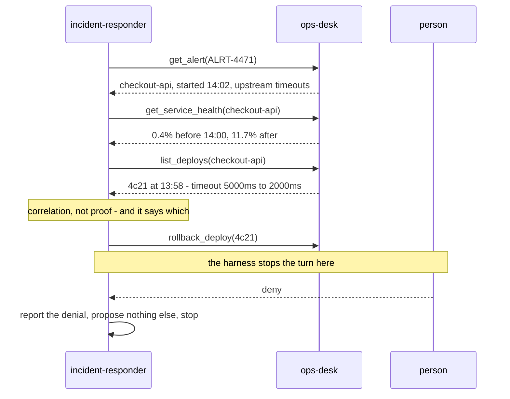

# Ops Desk

A small MCP server so the incident responder has somewhere real to investigate.

## Why it exists

The incident responder — the agent the hackathon calls its hero project — was written against
Sentry. Without a Sentry account it could not even be applied to the harness:

```
skipped  incident-responder  - Unknown MCP server "sentry" — not configured (HTTP 422)
```

So the one agent that most needed demonstrating was the one nobody could run. This is the same
shape of surface — alerts to read, deploys to correlate them against, and remediations that cannot
be taken without a person saying yes — backed by a fixture instead of a company's production
estate. No account, no key, no network.

It is **not a mock in the testing sense.** The read tools return the fixture, but the write tools
genuinely mutate state and genuinely cannot be undone from inside the process. An approval gate in
front of an operation that does nothing proves nothing.

## Running it

```bash
npm run ops-desk              # http://localhost:8795/mcp
OPS_DESK_PORT=9100 npm run ops-desk
curl -s localhost:8795/health
```

Register it with the harness once:

```bash
curl -X POST http://localhost:8790/api/v1/settings/mcp-servers \
  -H 'content-type: application/json' \
  -d '{"manifest":{"type":"remote","name":"ops-desk","url":"http://localhost:8795/mcp",
       "description":"Alerts, deploys and service health, with gated remediations."}}'
```

Then `npm run agents:apply` and `incident-responder` applies instead of being skipped.

## The tools, and which side of the gate they sit on

| Tool | Annotation | Gated |
| --- | --- | --- |
| `list_alerts` | `readOnlyHint` | no |
| `get_alert` | `readOnlyHint` | no |
| `list_deploys` | `readOnlyHint` | no |
| `get_service_health` | `readOnlyHint` | no |
| `list_actions_taken` | `readOnlyHint` | no |
| `rollback_deploy` | `destructiveHint` | **yes** |
| `restart_service` | `destructiveHint` | **yes** |

Every tool publishes annotations, and that matters more here than anywhere else in the project.
The selectors `@read-only`, `@write` and `@destructive` are resolved *from these hints*. A tool
that publishes none matches none of them — so a policy written only in tags lets it through
ungated. The shipped deepwiki server publishes zero annotations, which is exactly that hole;
`SECURITY.md` covers it, and the specs reach deepwiki by name for that reason. This server is what
a correctly annotated one looks like, and it is why `incident-responder` can safely say
`@destructive` and mean it.

The spec belts and braces anyway — tags *and* literal names:

```json
"enable_tools": ["@read-only", "rollback_deploy", "restart_service"],
"require_approval_for_tools": ["@write", "@destructive", "rollback_deploy", "restart_service"]
```

## What the fixture describes

A story with a right answer and two distractors, so an investigation can be wrong in an
interesting way rather than only right:

```mermaid
timeline
  title checkout-api, 26 August
  13:40 : error rate 0.4%%, p99 310ms
  13:58 : deploy 4c21 ships - payment-gateway timeout cut 5000ms to 2000ms
  14:00 : error rate 2.1%%, p99 1980ms
  14:02 : ALRT-4471 starts firing
  14:10 : error rate 11.7%%
```

`ALRT-4471` on `checkout-api` is the one to solve: deploy `4c21` cut an upstream timeout from
5000ms to 2000ms four minutes before the error rate moved, and the errors are upstream timeouts.
The correct action is to propose rolling back `4c21` — and then stop at the gate.

The distractors matter as much:

- `ALRT-4468` — search latency has been elevated since 09:40 with **no step change** and no deploy
  near it. Nothing to roll back. An agent that proposes one is guessing.
- `ALRT-4455` — a nightly export that already **resolved on its own**. An alert that fixed itself
  is a finding, not a failure, and proposing a remediation for it is worse than doing nothing.

## What a run looks like



## Notes for anyone extending it

- **A fresh server and transport per request.** Sharing one transport returns 500 on the first
  `initialize` — a stateless transport has no session for a second exchange to attach to. State
  lives at module scope, which is what makes a rollback in one request visible to the next.
- **State is in memory, not written back to `incidents.json`.** Restarting resets the story, which
  is what you want when demonstrating it twice.
- **If you add a tool, give it annotations.** An unannotated tool is invisible to every selector
  the approval policy uses, and it will run ungated without anything warning you. `npm run
  tools:audit` prints what each connector actually publishes.
