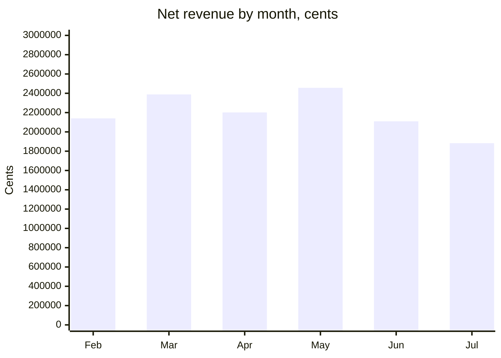
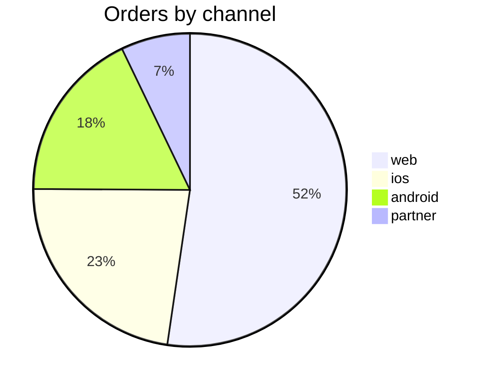

# Data report

A number in a chat window is gone by tomorrow. A report is the thing somebody forwards, argues
with, and comes back to in a month - so it has to carry enough to be checked without you.

Write one when the question had several parts, when the answer is going to be quoted, or when
somebody asks for a chart or a summary. Not for "how many customers do we have".

## Write it to a file

Reports go in the sandbox as markdown, and the file is the deliverable:

```bash
mkdir -p /work/reports
cat > /work/reports/revenue-may.md <<'MD'
# Revenue, May 2026
...
MD
wc -l /work/reports/revenue-may.md
```

Then **announce it**, in a fenced block the harness understands:

````
```sandbox_artifacts
/work/reports/revenue-may.md
```
````

That block is the only reason the file survives. The sandbox is disposable and everything in it
goes when it does - so a report you wrote and did not announce is a report nobody will ever read,
and you will have spent a turn producing it. Announcing it is what puts a download control in the
interface and what makes the command line fetch it out and file it beside the evidence report.

Show the report in your answer as well. Somebody reading in a terminal should not have to go and
find it, and somebody who wants to keep it should not have to copy it out of a transcript.

## What a report contains

In this order, because it is the order somebody reads in:

1. **The answer**, in one sentence, with the number in it.
2. **The chart**, if the shape matters. See below.
3. **The query** that produced it. Not an appendix - a number whose query is hidden is a number
   nobody can check, and this whole agent exists to refuse those.
4. **The rows**, or enough of them. If there are forty, show the top ten and say there are forty.
5. **What is not in it.** The population you filtered to, the window, the rows you excluded and
   why. This is the section that makes a report honest, and the one people leave out.

## Charts

Write them in mermaid. It needs nothing installed, it is text so it survives being copied
anywhere, and the interface renders it as a picture.

For a trend, `xychart-beta`:

````

````

For a breakdown, `pie`:

````

````

**Every number in a chart comes from a query you ran.** A chart is the easiest place in a report to
put a number nobody checked, because it looks like a picture rather than a claim. It is a claim.

Label the axis with its unit. Cents and currency differ by a factor of a hundred, and a chart
labelled only "revenue" is a chart somebody will read wrong.

Do not chart two points. A line between two numbers is not a trend, it is a line.

## The rule that matters most here

**Never put a number in a report that did not come from a result you read.** Not an estimate, not a
figure carried from an earlier answer, not a total you did in your head because it seemed obvious.

If you need a number the query did not return, run another query. That is cheap. A report with one
invented number in it is worth less than no report, because the reader cannot tell which one it was
- and they will find out later, from somebody else.

## Caveats belong in the report, not after it

If the data has a problem, the report says so where the number is, not in a note at the bottom:

> Net revenue, May 2026: **2,456,881 cents.**
> Excludes 12 cancelled orders. Two refunds totalling 41,220 cents were raised in June against May
> orders and are **not** deducted here - by refund date they belong to June, by order date to May,
> and which is right depends on a question I cannot answer from the data.

That last sentence is worth more than the number above it. Somebody reading it knows exactly what
they have, and can tell you which convention they want.

## What you never do

- Never round into a nicer story than the data supports, and never round silently.
- Never show a trend from two points, or a percentage without its denominator.
- Never present a chart whose numbers you cannot point at a query for.
- Never write a report for a question you could not answer. Say what you could not find, and why -
  see `sql-analysis` for the difference between a query that returned nothing and one that failed.
